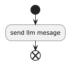

class: center, middle

# Agentic AI with Kotlin & Java

---

## Contents

* How we can integrate LLMs using code
* Examples in Koog, but we'll touch Spring AI as well

---

## When to Use

* Non labeled training data based on heuristics
* Dealing with language instead of numbers
* Making use of generative AI
* Fine with incorrectness as long as correct results outweigh incorrect ones
* Think virus scanners using heuristics to determine if a file is a virus rather than checksums: high rate of false positives but likely to also detect unknown threats

---

## Why do we need Code?

* **Oversight**: checkpoints where human intervention is required
* **Correctness**: custom code that can be used by the model to trigger code
* **Access to Data**: maybe we need access to stored data  
* **Reuse**: if required, can be pulled out of an AI Agent workflow

---

## Building Workflows Using Kotlin & Koog

Pull in the **koog** library in a new Kotlin & Gradle project and configure an API key, e.g. through an env variable. Many popular cloud service can be used, but also local LLM instances like Ollama

```sh
export GOOGLE_AI_API_KEY=your-api-key
```

```kt
dependencies {
    implementation("ai.koog:koog-agents:0.7.3")
}
```

---

## Simple Agent Call

```kt
suspend fun main() {
    val agent = AIAgent(
        promptExecutor = simpleGoogleAIExecutor(System.getenv("GOOGLE_AI_API_KEY")),
        systemPrompt = "You are a waiter at a Michelin starred restaurant",
        llmModel = GoogleModels.Gemini2_5Flash,
    )

    print(agent.run("Waiter, please tell me your name"))
    // I am a large language model, I do not have a name. 
    // How may I help you this evening?
}
```

---

## Giving a Helping Hand: Tools (MCP)

* Tools = Structured "Skills"
* Used to give the AI agent a list of well-defined callbacks that they can execute on the host, including passing in parameters from the LLM
* Can implement anything starting from reading files to requiring user interaction
* Can cut down on context size by providing a filtered answer
* Can query web services such as Google Maps or execute web requests using Selenium
* Bunch of predefined tools like asking users or reading/writing to files

---

## Wine Card Example (1/2)

```kt
data class Wine(val label: String, val year: Int, val stars: Int)

val wineCard = listOf(
    Wine(label = "Chateau Neuf", year = 2002, stars = 3),
    Wine(label = "Chateau Huit", year = 2003, stars = 4),
    Wine(label = "Chateau Sept", year = 2004, stars = 1),
)
```

---


## Wine Card Example (2/2)

```kt
class WineCardTool : ToolSet {
    @Tool
    @LLMDescription("Holds all available wines that can " +
            "be offered to the customer")
    fun fetchWineList(): String {
        return markdown {
            h1("Wine Card")
            bulleted {
                wineCard.forEach {
                    item {
                        +"* ${it.label}: stars: ${it.stars}, year: ${it.year}"
                    }
                }
            }
        }
    }
}
```

---

## Registering Tools

```kt
suspend fun main() {
    // create http client
    val agent = AIAgent(
        promptExecutor = simpleGoogleAIExecutor(System.getenv("GOOGLE_AI_API_KEY")),
        systemPrompt = "You are a waiter at a Michelin starred restaurant",
        llmModel = GoogleModels.Gemini2_5Flash,
        toolRegistry = ToolRegistry {
            tools(WineCardTool())
        },
    )

    print(agent.run("Waiter, what is the best wine that " +
            "you can recommend me from your winecard"))
    // From our wine card, I would recommend the Chateau Huit, with 4 stars from 
    // the year 2003. It is an excellent choice.
}
```

---

## Tool Parameters

We can also let the LLM pass parameters to the tool itself, but we need to explain the parameters using annotations. These annotations can also go onto classes passed as parameters.

```kt
class WineCardTool : ToolSet {
    @Tool
    @LLMDescription("Holds all available wines that can " +
            "be offered to the customer")
    fun fetchWineList(
        @LLMDescription("The year in which the wine was harvested")
        year: Int
    ): String {
        // ...
    }
}
```

---

## Strategies

* You can define AI agent flows using Strategies
* Each Strategy defines input and output types (both String, String here)
* First we define actions/nodes by using [Kotlin delegates](https://kotlinlang.org/docs/delegated-properties.html) (aka interceptors for getting/setting a variable), then we connect them using edges

---

## Simple Strategies

```kt
val flow = strategy<String, String>("Sends and Receives Message") {
    val sendLlmMessage by nodeLLMRequest()

    edge(nodeStart forwardTo sendLlmMessage)
    edge(sendLlmMessage forwardTo nodeFinish onAssistantMessage { true })
}
```



**onAssistantMessage { true }** evaluates to

```kt
onCondition { it is Message.Assistant } transformed {
    it.asAssistantMessage().content 
}
```


---

## Registering and Triggering Strategies

```kt
val agent = AIAgent<String, String>(
    promptExecutor = simpleGoogleAIExecutor(System.getenv("GOOGLE_AI_API_KEY")),
    systemPrompt = "Tell the model how to behave",
    llmModel = GoogleModels.Gemini2_5Flash,
    strategy = flow,
)
val result = agent.run("String passed to nodeStart node")
```

---

## Custom Nodes 

Custom Nodes can be defined by the node function

```kt
val upperCaseNode by node<String, String>("node_name") { input ->
    println("Processing input: $input")
    input.uppercase() // Transform the input to uppercase
}
```

---

## Custom Nodes and Prompts

```kt
data class ImageAndDescription(val image: ByteArray, val description: String)

val describeImgNode by node<String, ImageAndDescription>("node_name") { method ->
    llm.writeSession {
        appendPrompt {
            user {
                +"Explain what's in the following image using $method"
                image("/path/to/image.jpg")
            }
        }
        val message = requestLLMWithoutTools()
        toImageAndDescription(message)
    }
}
```

---

## Mapping LLM Responses

Remember **it.asAssistantMessage().content**? 

Each Response has a parts property which holds all text and files. Just getting the text is implemented as a filter over text parts: 

```kt
public sealed interface Message {
    public val content: String
        get() = parts.filterIsInstance<ContentPart.Text>()
            .joinToString(separator = "\n") { it.text }
}
```

---

## Automatic Mapping using an LLM

```kt
@Serializable
@LLMDescription("Holds username and description")
data class User(
    @property:LLMDescription("User Name") val userName: String,
    @property:LLMDescription("Description") val description: String,
)

val getUserNode by nodeLLMRequestStructured<User>(
    name = "parse-user-node",
    fixingParser = StructureFixingParser(
        model = OpenAIModels.Chat.GPT4o,
        retries = 3
    )
)
```
---
## Additional Features

* **Long and Short Term Memory**: Load previous conversations by session id or from a predefined location
* **Tracing & Logging**: Custom hooks to log LLM responses and requests
* **Spring Boot Integration**: Configure in application.yml, inject **PromptExecutor**
* **Spring AI Integration**: Can work with Spring AI models
* **Java API**

---

## Short Excursion: Spring AI

```java
@RestController
class MyController {
    private final ChatClient chatClient;

    public MyController(ChatClient.Builder chatClientBuilder) {
        this.chatClient = chatClientBuilder.build();
    }

    @GetMapping("/ai")
    String generation(String userInput) {
        return this.chatClient.prompt()
            .user(userInput)
            .call()
            .content();
    }
}
```
---

## Spring AI - Response Mapping

```java
ActorsFilms actorsFilms = ChatClient.create(chatModel).prompt()
        .user(u -> 
                u.text("Generate the filmography of 5 movies for {actor}.")
                    .param("actor", "Tom Hanks"))
        .call()
        .entity(ActorsFilms.class);
```

---

## Spring AI - Tools

```java
import java.time.LocalDateTime;
import org.springframework.ai.tool.annotation.Tool;
import org.springframework.context.i18n.LocaleContextHolder;

@Component
class DateTimeTools {

    @McpTool(description = "Get the current date and time in the user's timezone")
    String getCurrentDateTime() {
        return LocalDateTime.now().atZone(LocaleContextHolder.getTimeZone().toZoneId()).toString();
    }

}

String response = ChatClient.create(chatModel)
        .prompt("What day is tomorrow?")
        .tools(new DateTimeTools())
        .call()
        .content();
```
